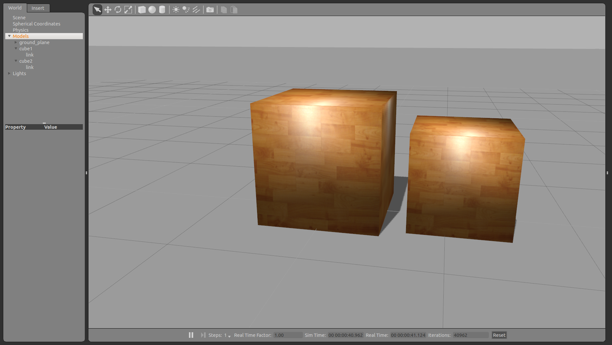

# Gazebo Link Attacher

## Overview

- Attach two Gazebo models with a virtual joint in a generalized grasp hack.

**Keywords:** gazebo, link, model

## License

- The source code is released under a [Apache License 2.0](https://github.com/Brazilian-Institute-of-Robotics/gazebo_ros_link_attacher/blob/main/LICENSE).

**Author:** Claudia Ramos\
**Affiliation:** Brazilian Institute of Robotics\
**Maintainer:** Claudia Ramos, <claudia.ramos@fieb.org.br>

The `gazebo_ros_link_attacher` package has been tested under ROS2 humble and Ubuntu 22.04. This package has been forked from <https://github.com/davidorchansky/gazebo_ros_link_attacher>.

## Installation

### Building

- **Building with colcon**

To build from source, clone the latest version from this repository into your `colcon` workspace and compile the package using

```sh
  cd YOUR_WORKSPACE/src
  git clone https://github.com/Brazilian-Institute-of-Robotics/gazebo_ros_link_attacher.git
  cd YOUR_WORKSPACE
  source /opt/ros/${ROS_DISTRO}/setup.bash
  colcon build --packages-select gazebo_ros_link_attacher --event-handlers console_direct+
  source install/setup.bash
```

- **Building from autoproj**

See build configuration based on autoproj. After Installation and configuration of autoproj, run the following commands:

```sh
  cd YOUR_WORKSPACE
  source env.sh
  amake gazebo_ros_link_attacher
  source install/setup.bash
```

### Unit Tests

Run the unit tests with

```sh
  colcon test --packages-select gazebo_ros_link_attacher --event-handlers console_direct+
```

Run the unit tests with autoproj

```sh
  autoproj test enable gazebo_ros_link_attacher
  amake
  autoproj test exec gazebo_ros_link_attacher
```

## Usage

## Run demo

Run the command below to start an empty world with the plugin `libgazebo_ros_link_attacher.so` loaded (in the *worlds* folder).

```sh
ros2 launch gazebo_ros_link_attacher test_attacher.py
```

It provides the `/link_attacher_node/attach` service to specify two models and their links to be attached. And `/link_attacher_node/detach` service to specify two models and their links to be detached.



In another shell, run the command below to spawn three cubes:

```sh
  ros2 run gazebo_ros_link_attacher spawn_models.py
```

The cubes will be attached all between themselves as (1,2), (2,3), (3,1). You can move them with the GUI and you'll see they will move together.

  ```sh
    ros2 run gazebo_ros_link_attacher attach.py
  ```

And with 'detach.py' the cubes will be detached and you can move them separately again.
  
  ```sh
    ros2 run gazebo_ros_link_attacher detach.py
  ```

You can also spawn items with the GUI and run a rosservice call:

```sh
  ros2 service call /attach 'gazebo_ros_link_attacher/srv/Attach' '{model_name_1: 'cube1',
  link_name_1: 'link',
  model_name_2: 'cube2',
  link_name_2: 'link'}'
````

And same thing to detach:

```sh
  ros2 service call /detach 'gazebo_ros_link_attacher/srv/Attach' '{model_name_1: 'cube1',
  link_name_1: 'link',
  model_name_2: 'cube2',
  link_name_2: 'link'}'
````

## Launch file

- [test_attacher.py](launch/test_attacher.py)

  - Start an empty world with the plugin `libgazebo_ros_link_attacher.so` loaded. Which provides the `/link_attacher_node/attach` service to specify two models and their links to be attached.

## Bugs & Feature Requests

- Please report bugs and request features using the [Issue Tracker](https://github.com/Brazilian-Institute-of-Robotics/gazebo_ros_link_attacher/issues).
